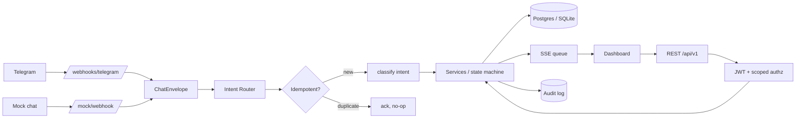
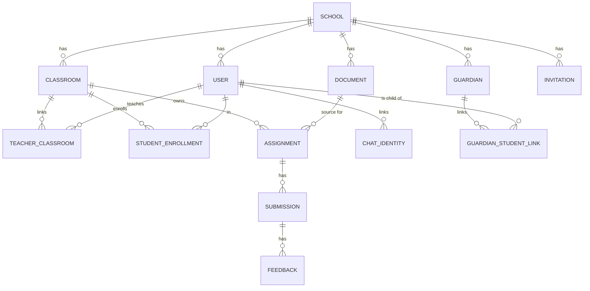

# School Operations Agent Platform

A multi-tenant FastAPI backend that turns messy school workflows — registrations, document uploads, chat-based progress updates, reminders, submissions, feedback — into auditable, role-scoped system actions. LLM output is always treated as a **proposal** that requires explicit approval before mutating state.

> Senior engineering take-home for SIM. Stack: FastAPI · SQLAlchemy · SQLite/Postgres · SSE · OpenAI-compatible LLM · Telegram.

---

## Architecture



## Domain model



## Access model

| Role | Can do | Cannot do |
|------|--------|-----------|
| **ADMIN** | Register school, invite teachers/students, create classrooms, ingest rosters/policies, view audit | Touch other schools' data |
| **TEACHER** | Create assignments, parse briefs, give feedback, view own classes | Touch other teachers' classes; create users directly |
| **STUDENT** | Submit work, message via Telegram, view own dashboard | See another student's submission; see teacher feedback for others |
| **GUARDIAN** | View redacted digest for linked child(ren) | See submission text, feedback text, or grades |
| **SYSTEM** | Send reminders within quiet hours / escalation policy | Mutate state without an audit row |

Server-side enforcement: every scoped endpoint loads the resource, then calls `assert_same_school()` which **always** writes an `ACCESS_DENIED` audit event on rejection and returns a generic 403 (so the resource's existence is never leaked).

## Submission state machine

```
NOT_STARTED → IN_PROGRESS → BLOCKED → SUBMITTED
                                          ↓
                                  FEEDBACK_GIVEN
                                   ↓          ↓
                          REVISION_REQUESTED  COMPLETED (terminal)
                                   ↓
                              (back to SUBMITTED)
```

Transitions are guarded; illegal jumps return 409 and emit `SUBMISSION_TRANSITION_REJECTED`.

---

## Quick start

```bash
git clone <your-repo-url>
cd School-Operations-Agent-Platform
cp .env.example .env             # fill in OPENAI_API_KEY at minimum
python -m venv .venv && source .venv/bin/activate
pip install -r requirements.txt
python seed.py                   # OPTIONAL: seeds two demo schools for cross-school tests
uvicorn app.main:app --reload
open http://127.0.0.1:8000
```

Default seeded admins:
- `admin@lincolnhigh.edu` / `demo-password-1234`
- `admin@oxford.edu` / `demo-password-1234` (used for the cross-school denial demo)

---

## Demo: minimum scenario (matches assignment Section 6)

### 1 · Register a school (no seeding required)
```bash
curl -X POST http://127.0.0.1:8000/api/v1/auth/register-school \
  -H "Content-Type: application/json" \
  -d '{"school_name":"Demo High","admin_name":"Alice","admin_email":"alice@demo.edu","admin_password":"longenoughpassword"}'
# Returns: {"access_token":"...","role":"ADMIN","school_id":"...","user_id":"..."}
```

### 2 · Create classroom + invite teacher
```bash
TOK=<token-from-step-1>
curl -X POST http://127.0.0.1:8000/api/v1/classrooms \
  -H "Authorization: Bearer $TOK" -H "Content-Type: application/json" \
  -d '{"name":"Grade 7-A"}'
# Returns classroom id; use as $CID

curl -X POST http://127.0.0.1:8000/api/v1/invitations \
  -H "Authorization: Bearer $TOK" -H "Content-Type: application/json" \
  -d "{\"role\":\"TEACHER\",\"invitee_name\":\"Mr Pat\",\"invitee_email\":\"pat@demo.edu\",\"classroom_id\":\"$CID\"}"
# Returns: {"token":"...","accept_url":"/api/v1/invitations/.../accept"}

# Teacher accepts (no auth header):
curl -X POST http://127.0.0.1:8000/api/v1/invitations/<token>/accept \
  -H "Content-Type: application/json" -d '{"password":"teacherpassword"}'
```

### 3 · Upload assignment brief (ambiguity → DRAFT → approve)
```bash
echo "Build a poster about photosynthesis. Submit photographs of the result." > brief.txt
curl -X POST "http://127.0.0.1:8000/api/v1/ingestion/upload-brief?classroom_id=$CID" \
  -H "Authorization: Bearer $TEACHER_TOK" -F file=@brief.txt
# Returns: {"status":"REQUIRES_CLARIFICATION","assignment_id":"...","clarification_question":"..."}

curl -X POST http://127.0.0.1:8000/api/v1/ingestion/assignments/<aid>/approve \
  -H "Authorization: Bearer $TEACHER_TOK" -H "Content-Type: application/json" \
  -d '{"due_date":"2026-07-15T17:00:00","approve":true}'
```

### 4 · Chat-driven blocked / submission (via mock or Telegram)
```bash
curl -X POST http://127.0.0.1:8000/api/v1/mock/webhook \
  -H "Content-Type: application/json" \
  -d '{"student_id":"s1","student_name":"Sam","message":"I am stuck"}'
# Dashboard SSE pushes status=BLOCKED instantly
```

### 5 · Scheduler with quiet hours
```bash
curl -X POST http://127.0.0.1:8000/api/v1/ingestion/trigger-scheduler \
  -H "Authorization: Bearer $TOK"
# Either {"status":"COMPLETED","nudged":[...],"escalated":[...]}
# or     {"status":"SKIPPED","reason":"QUIET_HOURS_ACTIVE"}
```

### 6 · Submission + feedback + revision
```bash
curl -X POST http://127.0.0.1:8000/api/v1/submissions \
  -H "Authorization: Bearer $STUDENT_TOK" -H "Content-Type: application/json" \
  -d '{"assignment_id":"<aid>","content":"My answer text"}'

curl -X POST http://127.0.0.1:8000/api/v1/submissions/<sid>/feedback \
  -H "Authorization: Bearer $TEACHER_TOK" -H "Content-Type: application/json" \
  -d '{"text":"Good first attempt","decision":"REVISION_REQUESTED"}'
```

### 7 · Wrong-context access denied
```bash
# Login to school B, try to read school A's classroom
curl -i -H "Authorization: Bearer $SCHOOL_B_TOK" \
     http://127.0.0.1:8000/api/v1/classrooms/<school-a-classroom-id>
# HTTP/1.1 403 Forbidden — + ACCESS_DENIED audit event written
```

### 8 · Audit timeline
```bash
curl http://127.0.0.1:8000/api/v1/mock/audit-timeline?limit=50
# Returns chronological events with workflow_id, actor_id, event_type, payload
```

---

## Telegram integration (real channel)

1. `@BotFather` → `/newbot` → save token in `.env` as `TELEGRAM_BOT_TOKEN`
2. Generate a random `TELEGRAM_WEBHOOK_SECRET`, add to `.env`
3. Deploy (Render/Fly/etc.) so Telegram can reach your `/api/v1/webhooks/telegram`
4. Register the webhook:
   ```bash
   curl "https://api.telegram.org/bot$TOKEN/setWebhook?url=https://<your-host>/api/v1/webhooks/telegram&secret_token=$SECRET"
   ```
5. Message the bot. Watch the dashboard update via SSE.

Idempotency: every inbound message is recorded in `inbound_chat_messages` with `UNIQUE(channel, message_id)`. Telegram retries become no-ops.

---

## Tests

```bash
pytest                            # everything
pytest tests/test_authorization.py -v    # the rubric-critical ones
```

What's covered:
- Auth: register / login / `/me` / bad tokens
- Authorization: cross-school denial + ACCESS_DENIED audit event
- State machine: every legal transition; illegal transitions return 409
- Intent classification: every documented intent, plus UNKNOWN safe fallback
- Parser: fallback when no API key, prompt-injection input does not crash

---

## Folder structure

```
app/
├── auth/               # JWT, password hashing, scoped dependencies
├── integrations/       # ChatEnvelope + Telegram adapter
├── routers/            # FastAPI routers (one per domain area)
├── services/           # Business logic (ai_parser, scheduler, intent_router, ...)
├── templates/          # Dashboard HTML
├── config.py           # pydantic-settings
├── database.py         # engine + get_db
├── main.py             # app factory, middleware, router wiring
├── models.py           # SQLAlchemy domain model
└── schemas.py          # Pydantic I/O schemas
docs/
├── adr/                # 3 short ADRs
├── THREAT_MODEL.md
└── RUNBOOK.md
tests/                  # pytest suite
seed.py                 # optional demo data
```

---

## Known limitations & trade-offs

- **PDF/DOCX ingestion** — only `.txt`, `.csv`, `.md`, `.json` are accepted directly; PDFs would need a converter (pdfplumber/docx2txt) which we left out to keep the dependency surface small.
- **Notification delivery** — the scheduler writes `REMINDER_SENT` audit rows but does not actually send SMS/Email; wiring is a one-line addition to `app/integrations/telegram.py::send_telegram_message`.
- **SQLite default** — fine for the take-home; for production set `DATABASE_URL=postgresql://...` in `.env`.
- **No Alembic migrations** — uses `Base.metadata.create_all` on startup. For production schemas, add Alembic.
- **Dashboard is single-page** — role-aware views would normally be three separate UIs (admin / teacher / student / guardian).
- **No virus scanning** on uploads — file-type + size guard only.

See `docs/THREAT_MODEL.md` for the full security posture.

---

## License

See `LICENSE`.
